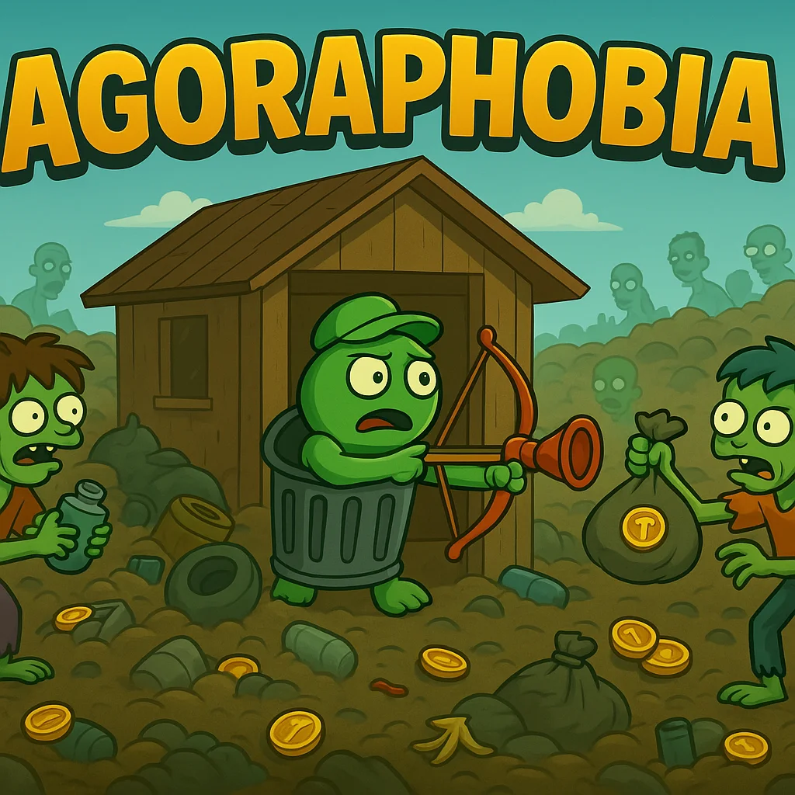
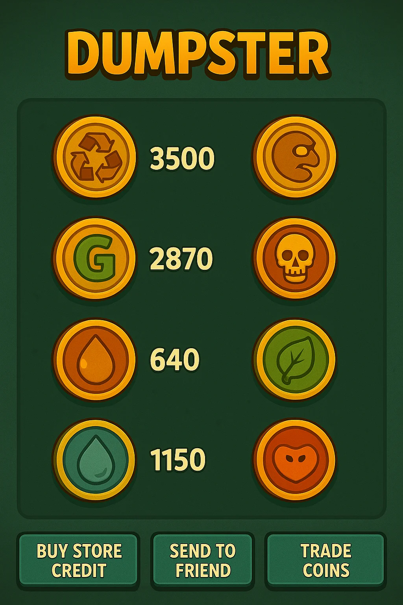
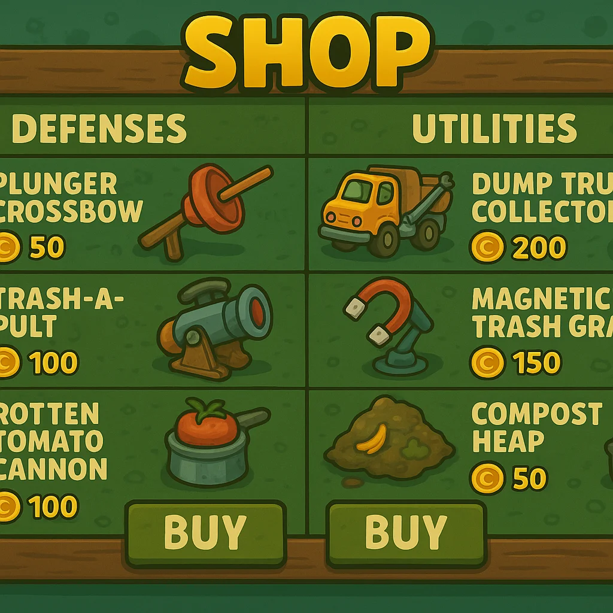
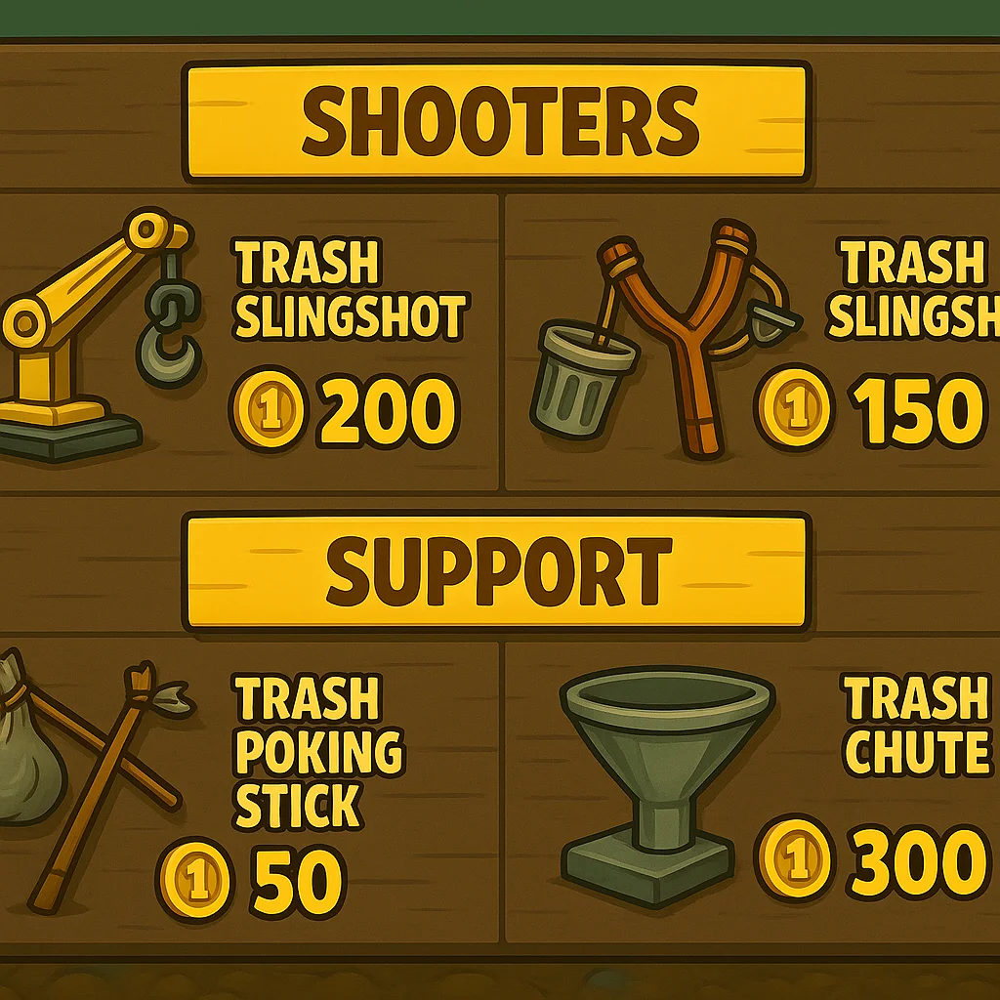
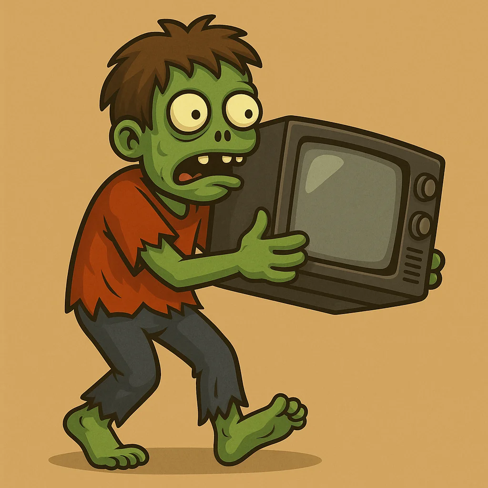

# Agoraphobia: Defend Your Trash

## Whitepaper: The Open-Source Gorbagana Onramp

**Version 2.0 | October 2025**  
**Gorbagana Ecosystem Foundation**

---

---

## Table of Contents

1. [Executive Summary](#executive-summary)
2. [The Problem: Crypto's Onboarding Barrier](#1-the-problem-cryptos-onboarding-barrier)
3. [The Solution: Free Game with Optional Wallet](#2-the-solution-free-game-with-optional-wallet)
4. [Core Mechanics](#3-core-mechanics)
5. [Token Launchpad](#4-token-launchpad)
6. [Tokenomics](#5-tokenomics)
7. [Growth Projections](#6-growth-projections)
8. [Business Model](#7-business-model)
9. [Launch Roadmap](#8-launch-roadmap)
10. [Visual Assets](#9-visual-assets)
11. [Early Adopter Incentives](#10-early-adopter-incentives)
12. [Risks and Considerations](#11-risks-and-considerations)
13. [Vision](#12-vision)

---

## Executive Summary

Agoraphobia is a free-to-play, open-source tower defense game designed to serve as Gorbagana's universal onramp. Players defend their junkyard from dumpster divers using trash-built weapons, earning TrashCoin (universal scoring) or any Gorbagana-native token.

**Monetization Model:**
- Free game with unlimited play and in-game store
- Optional $0.99 wallet upgrade unlocks real crypto withdrawals

**Dual-Track Architecture:**
- Gaming track: Free mobile game targeting mainstream adoption
- Crypto track: Token marketplace enabling multiple Gorbagana-native tokens

---

## 1. The Problem: Crypto's Onboarding Barrier

**Global Crypto Adoption Challenges (2025):**
- Less than 10% of 5.44B internet users own crypto
- 92% of crypto owners never use DeFi
- 13% cite wallet complexity as primary barrier
- Play-to-earn retention: 12% Week 1 (crypto-first)
- Mobile gaming retention: 68% Week 1 (game-first)

**Gorbagana's Challenge:** A whale-heavy network requires broader distribution to achieve sustainable network effects.

---

## 2. The Solution: Free Game with Optional Wallet

### 2.1 Free-to-Play Core

- No cost, no ads, no paywalls
- Tower defense gameplay: Plunger bows vs dumpster divers
- Built-in wallet (locked by default)
- All coins spendable in-game
- Initial target: 10M downloads, 3M monthly active users

### 2.2 $0.99 Wallet Upgrade

- One-time $0.99 payment unlocks withdrawals
- Estimated conversion: 3% of players (industry standard range)
- Target: 300K active wallets

### 2.3 Token Launchpad

- Any Gorbagana token can integrate with the game
- Custom skins, weapons, and maps for each token
- Auto-convert mechanism: 80% converts to TrashCoin for scoring
- Target: 1,000+ integrated tokens over time

**Player Journey:**  
Download free → Play and earn coins → Spend in-game  
97% remain free players (pure gaming experience)  
3% upgrade wallet → Become crypto users

---

## 3. Core Mechanics

### 3.1 Gameplay Loop

1. Defend shed from waves of dumpster divers
2. Place and upgrade trash-built weapons
3. Earn coins → Spend in-game or withdraw (if upgraded)
4. $0.99 one-time fee enables real-value withdrawals

### 3.2 Wallet States

| State | In-Game Spending | Withdrawals |
|-------|------------------|-------------|
| Free  | ✓                | ✗           |
| $0.99 | ✓                | ✓           |

### 3.3 Defense Tree

| Tier   | Weapon          | Cost   | DPS  |
|--------|-----------------|--------|------|
| Basic  | Plunger Bow     | 25 TC  | 10   |
| Mid    | Toaster Turret  | 150 TC | 45   |
| Epic   | Fridge Fortress | 750 TC | 200  |
| Mythic | Trash Tsunami   | 5K TC  | 1.2K |

---

## 4. Token Launchpad

**Token Integration Process:**
1. Pay 500 TC (approximately $50)
2. Upload custom skin, weapon, and map assets
3. Set emission rates (100K-10M per wave)
4. Launch → Players farm tokens → 80% auto-converts to TrashCoin

**Distribution Potential:**  
$50 launch fee → potential reach of 10K+ farmers → 70M+ token distribution

---

## 5. Tokenomics

### 5.1 TrashCoin (1B Total Supply)

| Allocation       | %   | Amount  | Vesting   |
|------------------|-----|---------|-----------|
| Gameplay Rewards | 55% | 550M TC | 36 months |
| Launch Fees      | 20% | 200M TC | 24 months |
| Wallet Upgrades  | 15% | 150M TC | Immediate |
| Treasury         | 10% | 100M TC | 12mo cliff|

**Daily Emissions:** 500K TC declining to 100K TC over 36 months

### 5.2 Burns (14% Annual Deflation)

| Mechanism   | Daily Burn | Annual Burn |
|-------------|------------|-------------|
| Upgrades    | 200K TC    | 73M TC      |
| Boosters    | 100K TC    | 36M TC      |
| Launch Fees | 50K TC     | 18M TC      |
| **Total**   | **350K TC**| **127M TC** |

### 5.3 Revenue Model

Projected monthly revenue → 60% allocated to TrashCoin buyback and burn  
→ Additional deflationary pressure  
→ Potential value appreciation for holders

---

## 6. Growth Projections

**Conservative Estimates:**
- Free game: 20M downloads → 6M monthly active users
- Wallet upgrades: 3% conversion = 600K wallets
- Token launches: 1,000+ coins over 24 months

---

## 7. Business Model

| Phase  | Revenue Source              | 12-Month Projection |
|--------|-----------------------------|---------------------|
| Launch | Token launch fees           | $250K               |
| Growth | Wallet upgrades + launches  | $2M                 |
| Scale  | Boosters + expanded launches| $10M+               |

Note: Projections are preliminary and subject to market conditions and execution.

---

## 8. Launch Roadmap

| Week | Milestone           | Target            |
|------|---------------------|-------------------|
| 1-2  | Unity MVP           | Core gameplay loop|
| 3-4  | Open source beta    | 50 testers        |
| 5    | Free launch         | 50K downloads     |
| 6-12 | Wallet upgrades     | 1,500 wallets     |
| 13+  | Token integrations  | First 10 tokens   |

---

## 9. Visual Assets

**Art Style:** Hybrid of Mario Bros and Plants vs Zombies aesthetics  

**Characters:**
- **Hero:** Agorabagana (trash can mascot with plunger bow)
- **Enemies:** "Dead inside" dumpster divers seeking trash treasures

**Visual Theme:** Post-apocalyptic junkyard with colorful, cartoonish art style that appeals to casual mobile gamers while maintaining the thematic edge of defending your territory.

---

## 10. Early Adopter Incentives

| Tier       | Benefit                        | Value   |
|------------|--------------------------------|---------|
| Launch OG  | Free token launch (first 100)  | $50K    |
| Token Lord | 10% discount on launch fees    | Ongoing |

---

## 11. Risks and Considerations

| Risk                    | Mitigation Strategy                    |
|-------------------------|----------------------------------------|
| Low conversion rate     | Focus on gameplay quality and retention|
| Token market volatility | 80% auto-convert mechanism             |
| Scalability challenges  | Phased rollout and infrastructure planning|

---

## 12. Vision

**Target Milestones:**
- 20M players
- 600K active wallets
- 1,000+ integrated tokens
- Sustainable token economy

**Positioning:** Gorbagana's mobile app store and mainstream gaming entry point

---

**Defend Your Trash. Build Your Empire.**

---

## About This Document

This whitepaper is a living document and will be updated as the project evolves. For the latest version, visit the [GitHub repository](https://github.com/iamabotama/aGORaphobia).

**Version History:**
- v2.0 (October 2025) - Revised with 3% conversion rate, professional tone
- v1.0 (October 2025) - Initial concept

**Contact:**
- GitHub Issues: [Report problems or suggestions](https://github.com/iamabotama/aGORaphobia/issues)
- Email: [Coming Soon]

**License:** This document is released under Creative Commons Attribution 4.0 International (CC BY 4.0)
